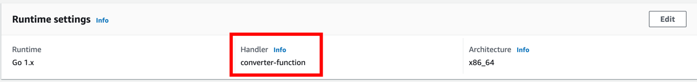
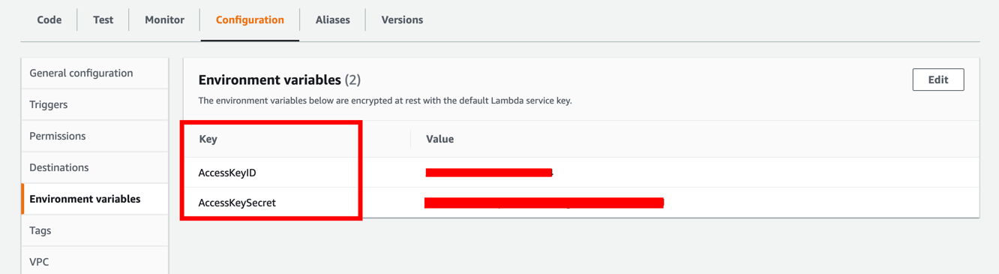
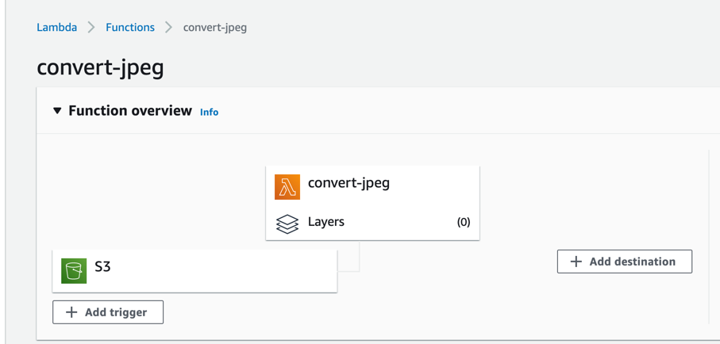
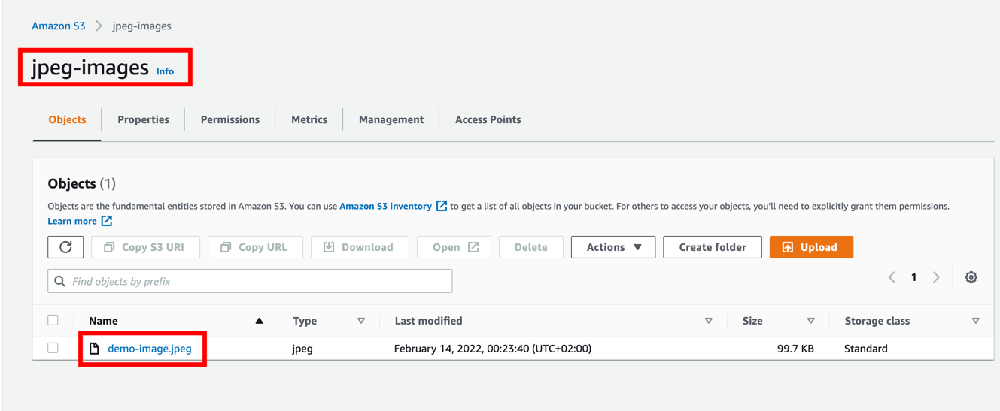
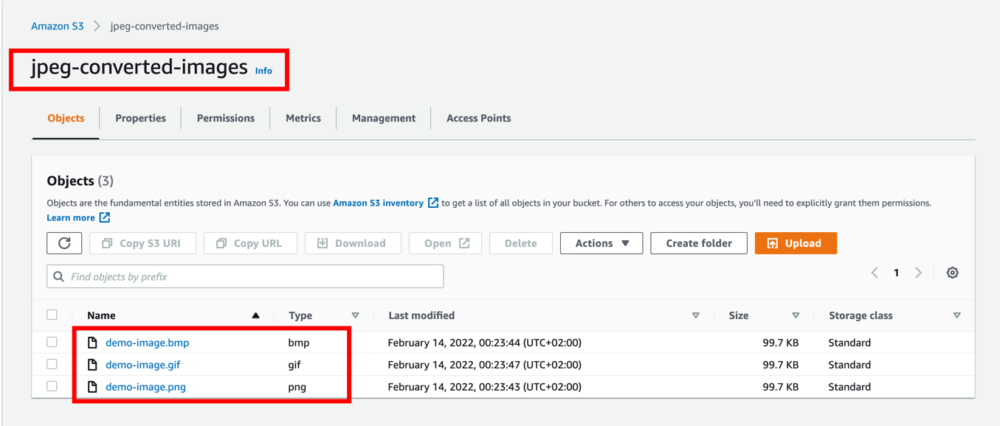
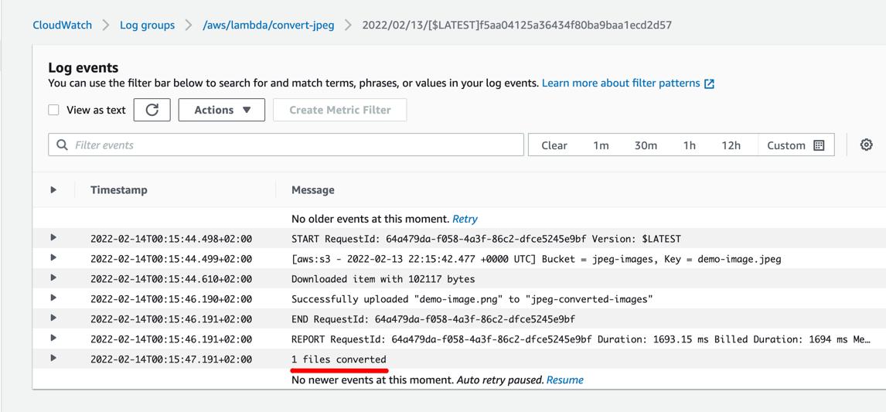

# aws-lambda
Convert JPEG images from S3 bucket to BMP, GIF, PNG into another bucket

### Setup two buckets
- `jpeg-images` for source jpeg images
- `converted-jpeg-images` for converted jpeg images

### Setup lambda
- Create Go 1.x lambda function with S3 trigger (`jpeg-images`)
- Build go executable
```shell
cd ./function
GOOS=linux go build -o converter-function main.go
```
- Make zip from `converter-function` executable and upload to AWS lambda
- Setup Runtime settings to invoke go executable
  
- Add env variables to use S3 credentials for you IAM role: `AccessKeyID`, `AccessKeySecret`

  

Result lambda scheme:



### Test
Upload jpg image to `jpeg-images` bucket

`jpeg-images`



`converted-jpeg-images` after couple of seconds



and check CloudWatch logs

